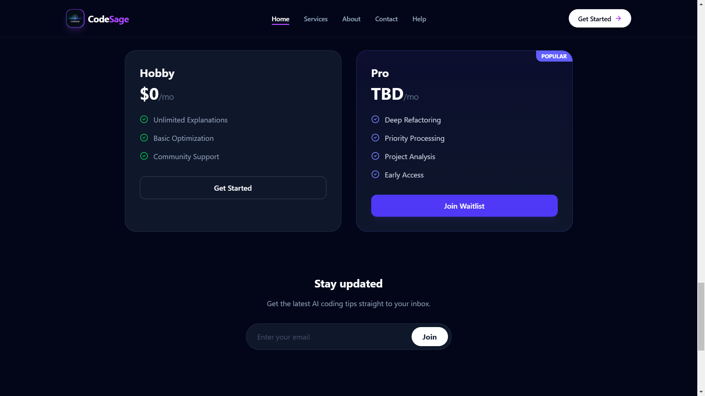

# 🧙‍♂️ CodeSage - AI Code Assistant


> **Understand code instantly.** CodeSage decodes complex logic into plain English, suggests optimizations, and refactors your code using the power of Llama-3 and Groq Cloud.

-----

## 🚀 Overview

CodeSage is a SaaS-style developer tool designed to bridge the gap between complex code and human understanding. It uses advanced Large Language Models (LLMs) to analyze code snippets and provide:

1.  **Explanations:** Line-by-line logic breakdown.
2.  **Optimization:** Big O reduction and efficiency tips.
3.  **Trimming:** Removing dead code and redundancy.
4.  **Suggestions:** Best practices and architectural advice.

Built with the **MERN Stack** and **Groq Cloud** for blazing-fast inference.

-----

## ✨ Key Features

  * **⚡ Blazing Fast AI:** Powered by Groq LPUs running Llama-3-70b for near-instant results.
  * **🎨 Modern IDE Interface:** A dark-mode, VS Code-inspired editor with syntax highlighting.
  * **🛠 Smart Tools:** Explain, Summarize, Optimize, and Trim code with one click.
  * **📱 Fully Responsive:** Glassmorphism UI that looks great on Desktop, Tablet, and Mobile.
  * **📧 EmailJS Integration:** Serverless contact forms with auto-reply functionality.
  * **📄 Export Options:** Copy to clipboard or download analysis as `.txt`.

-----

## 📸 Application Tour

### 1. Modern SaaS Landing Page
> Features a responsive glassmorphism design with clear value propositions.
 | 

### 2. Intelligent Code Editor (IDE)
> A split-screen environment with syntax highlighting, tabs for different AI actions (Explain, Trim, Optimize), and instant feedback.


### 3. Authentication & Pricing
| Secure Login | Transparent Pricing |
|:---:|:---:|
|  |  |
> **Left:** Secure authentication with visual feedback. **Right:** Clear pricing tiers to build user trust.

## 🛠️ Tech Stack

### Frontend

  * **Framework:** React (Vite)
  * **Styling:** Tailwind CSS, Framer Motion (Animations)
  * **Icons:** Lucide React
  * **Routing:** React Router DOM
  * **Utilities:** React Hot Toast (Notifications), React Syntax Highlighter

### Backend

  * **Runtime:** Node.js
  * **Framework:** Express.js
  * **AI Provider:** Groq SDK (Llama 3 Model)
  * **Caching:** Node-Cache (To reduce API usage for repeated queries)

-----

## 📸 Screenshots

| Home Page | Analysis IDE |
|:---:|:---:|
|  |  |

*(Replace these placeholders with actual screenshots of your app)*

-----

## ⚡ Getting Started

Follow these steps to run CodeSage locally.

### 1\. Clone the Repository

```bash
git clone https://github.com/your-username/codesage.git
cd codesage
```

### 2\. Frontend Setup

Navigate to the client folder and install dependencies.

```bash
cd client
npm install
```

Create a `.env` file in the `client` directory:

```env
VITE_EMAILJS_SERVICE_ID=your_service_id
VITE_EMAILJS_TEMPLATE_ID=your_template_id
VITE_EMAILJS_PUBLIC_KEY=your_public_key
VITE_AUTOREPLY_EMAILJS_TEMPLATE_ID=your_auto_reply_id
```

Run the frontend:

```bash
npm run dev
```

### 3\. Backend Setup

Navigate to the server folder and install dependencies.

```bash
cd ../server
npm install
```

Create a `.env` file in the `server` directory:

```env
PORT=5000
GROQ_API_KEY=your_groq_api_key
```

Run the backend:

```bash
node index.js
# or
npm run dev
```

-----

## 🔌 API Endpoints

The backend exposes a single robust endpoint for code analysis.

### `POST /api/analyze`

**Request Body:**

```json
{
  "code": "function add(a, b) { return a + b; }",
  "language": "javascript",
  "action": "explain" // or "optimize", "trim"
}
```

**Response:**

```json
{
  "optimizedCode": "...",
  "explanation": "...",
  "complexity": "O(1)"
}
```

-----

## 🤝 Contributing

Contributions are welcome\!

1.  Fork the project.
2.  Create your Feature Branch (`git checkout -b feature/AmazingFeature`).
3.  Commit your changes (`git commit -m 'Add some AmazingFeature'`).
4.  Push to the Branch (`git push origin feature/AmazingFeature`).
5.  Open a Pull Request.

-----

## 📧 Contact

**Anubhaw Gupta**

  * **Email:** anubhawg.cse.jisu22@gmail.com
  * **GitHub:** [github.com/AnbCrafts](https://github.com/AnbCrafts)
  * **LinkedIn:** [linkedin.com/in/anubhaw](https://www.google.com/search?q=https://linkedin.com/in/anubhaw)

-----

Made with ❤️ and ☕ by Anubhaw.